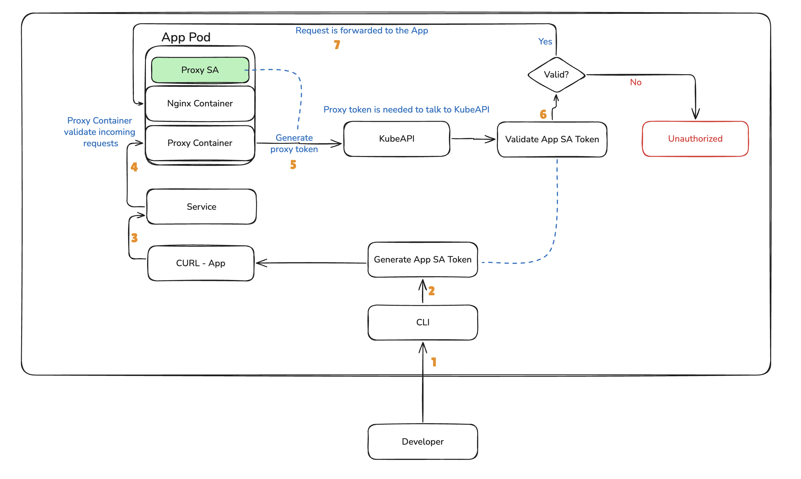

# k8s-rbac-basic

## Commands
``` /bin/bash
kubectl apply -f .
kubectl set context --current --namespace=demo-namespace
kubectl get all -n demo-namespace

## Test access without token
curl -k https://localhost:32000
## will get Unauthorized message

## Test access with token
export TOKEN=$(kubectl get secret demo-sa-token -n demo-namespace -o jsonpath="{.data.token}" | base64 -d) 
curl -k https://localhost:32000 -H "Authorization: Bearer $TOKEN"
```

## Workflow
